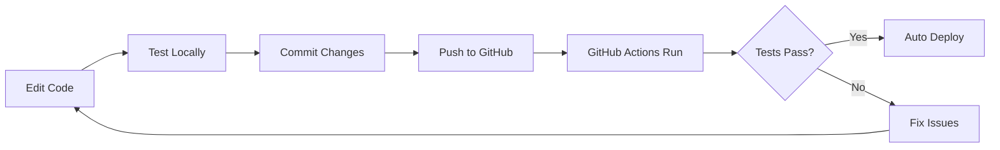
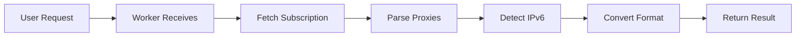

# 📁 Project Structure

Complete overview of the Worker Subscription Converter repository structure.

## 📂 Directory Layout

```
worker-subscription-converter/
├── 📄 worker_to_sub.js          # Main worker script (800+ lines)
├── 📄 wrangler.toml             # Cloudflare Workers configuration
├── 📄 package.json              # Node.js dependencies and scripts
├── 📄 .gitignore                # Git ignore rules
│
├── 📚 Documentation
│   ├── README.md                # Main documentation
│   ├── QUICKSTART.md            # Quick start guide (5 min setup)
│   ├── EXAMPLES.md              # Usage examples and recipes
│   ├── DEPLOYMENT.md            # Deployment guide
│   ├── CONTRIBUTING.md          # Contribution guidelines
│   ├── CHANGELOG.md             # Version history
│   ├── LICENSE                  # MIT License
│   └── PROJECT_STRUCTURE.md     # This file
│
├── 🤖 GitHub Actions
│   └── .github/
│       ├── workflows/
│       │   ├── deploy.yml       # Auto-deploy to Cloudflare
│       │   └── test.yml         # Run tests on PR
│       ├── ISSUE_TEMPLATE/
│       │   ├── bug_report.md
│       │   └── feature_request.md
│       └── PULL_REQUEST_TEMPLATE.md
│
└── 🛠 Scripts
    └── scripts/
        ├── quick-start.sh       # Interactive setup
        ├── test-local.sh        # Local testing
        └── update-dependencies.sh
```

## 📄 File Descriptions

### Core Files

#### `worker_to_sub.js` (Main Worker)
**Lines:** ~800+  
**Purpose:** Core Cloudflare Worker script

**Sections:**
1. **Configuration** (lines 1-50)
   - Default settings
   - IPv6 patterns
   - Clash template

2. **Utilities** (lines 51-150)
   - Logger with debug mode
   - Base64 encoder/decoder
   - IPv6 detection
   - Helper functions

3. **Proxy Parsers** (lines 151-400)
   - `parseVMess()` - VMess protocol
   - `parseVLESS()` - VLESS protocol
   - `parseTrojan()` - Trojan protocol
   - `parseShadowsocks()` - SS protocol
   - `parseShadowsocksR()` - SSR protocol

4. **Format Converters** (lines 401-550)
   - `toClashProxy()` - Convert to Clash format
   - `toSurgeProxy()` - Convert to Surge format
   - `generateClashConfig()` - Full Clash YAML
   - `generateSurgeConfig()` - Full Surge conf

5. **Request Handler** (lines 551-700)
   - Main request processing
   - URL parameter parsing
   - Error handling
   - Response generation

6. **UI** (lines 701-800)
   - HTML usage page
   - Examples and documentation

#### `wrangler.toml`
**Purpose:** Cloudflare Workers configuration

```toml
name = "worker-subscription-converter"
main = "worker_to_sub.js"
compatibility_date = "2024-01-01"

[env.dev]
name = "worker-subscription-converter-dev"

[env.production]
name = "worker-subscription-converter"
routes = []  # Add custom domains here
```

#### `package.json`
**Purpose:** npm configuration and scripts

**Scripts:**
- `dev` - Local development server
- `deploy` - Deploy to Cloudflare
- `deploy:dev` - Deploy to dev environment
- `deploy:prod` - Deploy to production
- `tail` - View live logs

**Dependencies:**
- `wrangler` - Cloudflare Workers CLI

---

## 📚 Documentation Files

### README.md
**Size:** ~500 lines  
**Audience:** Everyone  
**Content:**
- Overview and features
- Installation guide
- API reference
- Usage examples
- Configuration options

### QUICKSTART.md
**Size:** ~200 lines  
**Audience:** New users  
**Content:**
- 5-minute setup guide
- Copy-paste commands
- First use examples
- Basic troubleshooting

### EXAMPLES.md
**Size:** ~600 lines  
**Audience:** Users looking for recipes  
**Content:**
- Basic usage examples
- Advanced scenarios
- Client configuration
- Integration examples
- Troubleshooting guides

### DEPLOYMENT.md
**Size:** ~500 lines  
**Audience:** Users deploying to production  
**Content:**
- Step-by-step deployment
- Custom domain setup
- Environment configuration
- CI/CD setup
- Monitoring and logging

### CONTRIBUTING.md
**Size:** ~400 lines  
**Audience:** Contributors  
**Content:**
- How to contribute
- Development setup
- Code style guide
- Pull request process
- Testing guidelines

### CHANGELOG.md
**Size:** ~100 lines  
**Audience:** Everyone  
**Content:**
- Version history
- New features
- Bug fixes
- Breaking changes

---

## 🤖 GitHub Actions

### deploy.yml
**Triggers:**
- Push to `main` branch
- Pull requests
- Manual workflow dispatch

**Jobs:**
1. **Lint** - Validate JavaScript syntax
2. **Deploy-Dev** - Deploy to dev on PR
3. **Deploy-Prod** - Deploy to prod on merge

### test.yml
**Triggers:**
- Push to any branch
- Pull requests

**Jobs:**
- Syntax validation
- Multi-Node.js version testing
- Local worker testing

---

## 🛠 Scripts

### quick-start.sh
**Purpose:** Interactive setup wizard

**Features:**
- Dependency checking
- Menu-driven interface
- Local testing
- Deployment help

**Usage:**
```bash
chmod +x scripts/quick-start.sh
./scripts/quick-start.sh
```

### test-local.sh
**Purpose:** Automated local testing

**Tests:**
- Root endpoint
- Error handling
- Response formats
- Content validation

**Usage:**
```bash
chmod +x scripts/test-local.sh
./scripts/test-local.sh
```

### update-dependencies.sh
**Purpose:** Safe dependency updates

**Features:**
- Check for outdated packages
- Interactive update
- Automatic testing after update
- Security audit

**Usage:**
```bash
chmod +x scripts/update-dependencies.sh
./scripts/update-dependencies.sh
```

---

## 🔧 Configuration Files

### .gitignore
**Purpose:** Exclude files from Git

**Ignored:**
- `node_modules/`
- `.wrangler/`
- `.env` files
- Editor files
- Logs

### .github/ISSUE_TEMPLATE/
**Purpose:** Standardize issue reporting

**Templates:**
- `bug_report.md` - Bug reports
- `feature_request.md` - Feature requests

### .github/PULL_REQUEST_TEMPLATE.md
**Purpose:** Standardize PR submissions

**Sections:**
- Description
- Type of change
- Testing checklist
- Screenshots
- Breaking changes

---

## 📊 Code Statistics

### worker_to_sub.js

| Component | Lines | Percentage |
|-----------|-------|------------|
| Configuration | 50 | 6% |
| Utilities | 100 | 12% |
| Parsers | 250 | 31% |
| Converters | 150 | 19% |
| Handler | 150 | 19% |
| UI | 100 | 12% |
| **Total** | **800** | **100%** |

### Documentation

| File | Lines | Words |
|------|-------|-------|
| README.md | 500 | 3,500 |
| QUICKSTART.md | 200 | 1,400 |
| EXAMPLES.md | 600 | 4,200 |
| DEPLOYMENT.md | 500 | 3,500 |
| CONTRIBUTING.md | 400 | 2,800 |
| **Total** | **2,200** | **15,400** |

---

## 🎯 Key Features by File

### worker_to_sub.js
- ✅ 5 protocol parsers (VMess, VLESS, Trojan, SS, SSR)
- ✅ IPv6 auto-detection
- ✅ 3 output formats (Clash, Surge, JSON)
- ✅ Base64 encoding/decoding
- ✅ Error handling and logging
- ✅ Request timeout management
- ✅ Response caching
- ✅ Web UI

### Documentation
- ✅ Comprehensive guides
- ✅ Copy-paste examples
- ✅ Troubleshooting help
- ✅ API reference
- ✅ Contribution guidelines

### Automation
- ✅ Auto-deploy on push
- ✅ Auto-test on PR
- ✅ Interactive setup scripts
- ✅ Local testing tools

---

## 🔄 Workflow

### Development Flow



### User Flow



---

## 📈 Project Metrics

- **Total Files:** 20+
- **Total Lines of Code:** 800+
- **Total Lines of Docs:** 2,200+
- **Supported Protocols:** 5
- **Output Formats:** 3
- **GitHub Actions:** 2
- **Scripts:** 3
- **Documentation Files:** 7

---

## 🔗 Quick Links

- 🏠 [Homepage](README.md)
- ⚡ [Quick Start](QUICKSTART.md)
- 💡 [Examples](EXAMPLES.md)
- 🚀 [Deployment](DEPLOYMENT.md)
- 🤝 [Contributing](CONTRIBUTING.md)
- 📝 [Changelog](CHANGELOG.md)
- 📄 [License](LICENSE)

---

## 🎓 Learning Path

1. **Beginner:** Start with [QUICKSTART.md](QUICKSTART.md)
2. **User:** Read [EXAMPLES.md](EXAMPLES.md)
3. **Deployer:** Follow [DEPLOYMENT.md](DEPLOYMENT.md)
4. **Contributor:** Check [CONTRIBUTING.md](CONTRIBUTING.md)
5. **Maintainer:** Review all documentation

---

**Last Updated:** 2024-02-24  
**Version:** 2.0.0
